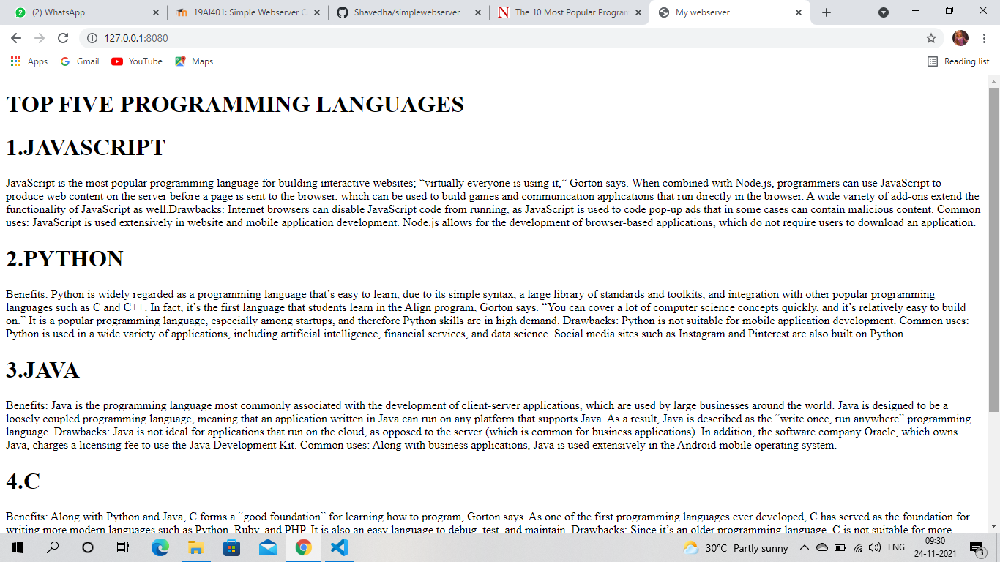

# Developing a Simple Webserver
## AIM:
To develop a simple webserver to describe about five programming languages

## DESIGN STEPS:
### Step 1: 
HTML content creation
### Step 2:
Design of webserver workflow
### Step 3:
Implementation using Python code
### Step 4:
Serving the HTML pages.
### Step 5:
Testing the webserver

## PROGRAM:
```
from http.server import HTTPServer, BaseHTTPRequestHandler
content = """
<!DOCTYPE html>
<html>
<head>
<title>My webserver</title>
</head>
<body>
<h1>TOP FIVE PROGRAMMING LANGUAGES</h1>

<h1> 1.JAVASCRIPT</h1>
<p> JavaScript is the most popular programming language for building interactive websites; “virtually everyone is using it,” Gorton says. When combined with Node.js, programmers can use JavaScript to produce web content on the server before a page is sent to the browser, which can be used to build games and communication applications that run directly in the browser. A wide variety of add-ons extend the functionality of JavaScript as well.Drawbacks: Internet browsers can disable JavaScript code from running, as JavaScript is used to code pop-up ads that in some cases can contain malicious content. 

Common uses: JavaScript is used extensively in website and mobile application development. Node.js allows for the development of browser-based applications, which do not require users to download an application. </p>

<h1> 2.PYTHON</h1>
<p>Benefits: Python is widely regarded as a programming language that’s easy to learn, due to its simple syntax, a large library of standards and toolkits, and integration with other popular programming languages such as C and C++. In fact, it’s the first language that students learn in the Align program, Gorton says. “You can cover a lot of computer science concepts quickly, and it’s relatively easy to build on.” It is a popular programming language, especially among startups, and therefore Python skills are in high demand.
Drawbacks: Python is not suitable for mobile application development.
Common uses: Python is used in a wide variety of applications, including artificial intelligence, financial services, and data science. Social media sites such as Instagram and Pinterest are also built on Python.</p>

<h1> 3.JAVA</h1>
<p>Benefits: Java is the programming language most commonly associated with the development of client-server applications, which are used by large businesses around the world. Java is designed to be a loosely coupled programming language, meaning that an application written in Java can run on any platform that supports Java. As a result, Java is described as the “write once, run anywhere” programming language.

Drawbacks: Java is not ideal for applications that run on the cloud, as opposed to the server (which is common for business applications). In addition, the software company Oracle, which owns Java, charges a licensing fee to use the Java Development Kit.

Common uses: Along with business applications, Java is used extensively in the Android mobile operating system.</p>

<h1> 4.C</h1>
<p>Benefits: Along with Python and Java, C forms a “good foundation” for learning how to program, Gorton says. As one of the first programming languages ever developed, C has served as the foundation for writing more modern languages such as Python, Ruby, and PHP. It is also an easy language to debug, test, and maintain.

Drawbacks: Since it’s an older programming language, C is not suitable for more modern use cases such as websites or mobile applications. C also has a complex syntax as compared to more modern languages.

Common uses: Because it can run on any type of device, C is often used to program hardware, such as embedded devices in automobiles and medical devices used in healthcare. </p>

<h1> 5.C++ </h1>
<p>Benefits: C++ is an extension of C that works well for programming the systems that run applications, as opposed to the applications themselves. C++ also works well for multi-device and multi-platform systems. Over time, programmers have written a large set of libraries and compilers for C++. Being able to use these utilities effectively is just as important to understanding a programming language as writing code, Gorton says.

Drawbacks: Like C, C++ has complex syntax and an abundance of features that can make it complicated for new programmers. C++ also does not support run-time checking, which is a method of detecting errors or defects while software is running. 

Common uses: C++ has many uses and is the language behind everything from computer games to mathematical simulations.</p>


</body>
</html>
"""
class myhandler(BaseHTTPRequestHandler):
    def do_GET(self):
        print("request received")
        self.send_response(200)
        self.send_header('content-type', 'text/html; charset=utf-8')
        self.end_headers()
        self.wfile.write(content.encode())
server_address = ('',8080)
httpd = HTTPServer(server_address,myhandler)
print("my webserver is running...")
httpd.serve_forever()
```


## OUTPUT:




## RESULT:
The above simpleserver has been developed to display about top five programming languages